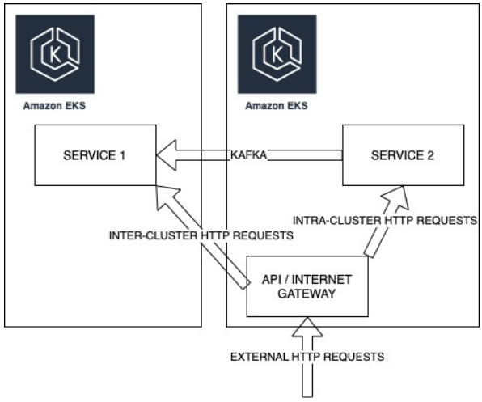

# Cilium 10

Piotr Makarewicz  
Arkadiusz Wołk  
Mateusz Zalewski  

## 1. Introduction
This case study aims to examine the features of Cilium which is goal is an “open source project to provide networking, security, and observability for cloud native environments such as Kubernetes clusters and other container orchestration platforms”, as described on Cilium main page.(Source: https://cilium.io/get-started/, access date: 31 Mar 2023)

Its goal is to showcase a portion of Cilium’s capabilities while deepening our understanding of it in the process.

## 2. Theoretical background
At the foundation of Cilium is a new Linux kernel technology called eBPF, which enables the dynamic insertion of powerful security, visibility, and networking control logic into the Linux kernel. eBPF is used to provide high-performance networking, multi-cluster and multi-cloud capabilities, advanced load balancing, transparent encryption, extensive network security capabilities, transparent observability, and much more. (Source: https://cilium.io/get-started/, access date: 31 Mar 2023)

Hubble is a fully distributed networking and security observability platform for cloud native workloads. It is built on top of Cilium and eBPF to enable deep visibility into the communication and behavior of services as well as the networking infrastructure in a completely transparent manner. (Source: https://github.com/cilium/hubble, access date: 31 Mar 2023)

## 3.Case study concept description
Testing using AWS cloud provider.

### Main goals:
 - observe communication between nodes within one cluster
 - enable and observe communication between nodes across different clusters.

### High level system diagram

### Cluster Mesh
ClusterMesh is Cilium’s multi-cluster implementation that provides the following features:
- Inter-cluster pod-to-pod connectivity without gateways or proxies.
- Network policy enforcement across clusters.
- Encryption in transit between nodes within a cluster as well as across cluster boundaries.
- Show that using cilium gateways and proxies can be avoided.
- Enforce cluster wide policy.
- Encrypt communication across cluster boundaries.
- View system's current state using hubble

https://aws.amazon.com/blogs/containers/a-multi-cluster-shared-services-architecture-with-amazon-eks-using-cilium-clustermesh/

## Work organization

| Author             | Main focus |
| -----------        | ----------- |
| Piotr Makarewicz   | AWS infrastructure setup |
| Arkadiusz Wołk     | Hubble |
| Mateusz Zalewski   | Service Mesh |