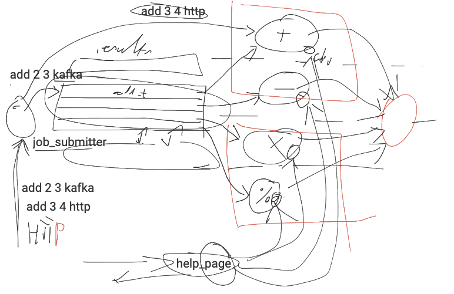

# Cilium 10

Piotr Makarewicz  
Arkadiusz Wołk  
Mateusz Zalewski  

## 1. Introduction
This case study aims to examine the features of Cilium which is goal is an “open source project to provide networking, security, and observability for cloud native environments such as Kubernetes clusters and other container orchestration platforms”, as described on Cilium main page.(Source: https://cilium.io/get-started/, access date: 31 Mar 2023)

Its goal is to showcase a portion of Cilium’s capabilities while deepening our understanding of it in the process.

## 2. Theoretical background

### eBPF

At the foundation of Cilium is a new Linux kernel technology called eBPF, which enables the dynamic insertion of powerful security, visibility, and networking control logic into the Linux kernel. eBPF is used to provide high-performance networking, multi-cluster and multi-cloud capabilities, advanced load balancing, transparent encryption, extensive network security capabilities, transparent observability, and much more. (Source: https://cilium.io/get-started/, access date: 31 Mar 2023)

### Hubble

Hubble is a fully distributed networking and security observability platform for cloud native workloads. It is built on top of Cilium and eBPF to enable deep visibility into the communication and behavior of services as well as the networking infrastructure in a completely transparent manner. (Source: https://github.com/cilium/hubble, access date: 31 Mar 2023)

### ClusterMesh
ClusterMesh is Cilium’s multi-cluster implementation that provides the following features:
- Inter-cluster pod-to-pod connectivity without gateways or proxies.
- Network policy enforcement across clusters.
- Encryption in transit between nodes within a cluster as well as across cluster boundaries.
- Show that using cilium gateways and proxies can be avoided.
- Enforce cluster wide policy.
- Encrypt communication across cluster boundaries.
- View system's current state using hubble

(Source: https://aws.amazon.com/blogs/containers/a-multi-cluster-shared-services-architecture-with-amazon-eks-using-cilium-clustermesh/, access date: 26 Apr 2023)

## 3. Case study concept description

### Main goals:
 - observe communication between nodes within one cluster using Hubble
 - enable and observe communication between nodes across different clusters using Hubble
 - see how security policies in Cilium work (filtering access based on L4 and L7 criteria)
 - examine the shared service mechanism in multi-cluster environment
 - compare the performance of eBPF-based direct routing vs. standard encapsulation in virtual network devices

### High level system diagram (TODO redraw and describe)

## 4. Technology selection

### Kubernetes cluster provider

For local development, tests in our early work we will use Kubernetes cluster hosted with **minikube**.

For the final demo, we will host the infrastructure on AWS Cloud using **Amazon EKS** Kubernetes cluster.

### Communication protocols

We want to observe different ways in which services within K8s pods communicate.

For synchronous communication, we will observe **HTTP(S)** requests sent from outside clusters to services inside as well as between services.

For asynchronous middleware-based communication we will use **Kafka** as our message broker.

### Implementation language

We will select **Python** as our implementation language because of its simplicity, expressivity and the amount of libraries that can help us. We will use **requests** library to send HTTP(S) requests, **flask** framework to create REST endpoints in services and **confluent-kafka** library to produce and consume Kafka messages.

## 5. Initial configuration description

Our infrastructure will contain of 3 or 4 K8s clusters (depending on setup we choose):

### Cluster 1: Client-interaction cluster

This cluster will contain the services that the clients will be able to communicate with via HTTP requests

**job_submitter** is the most important service. It will expose an endpoint called `/submit`. In request payload, user can specify:
 - operation type (addition, subtraction, multiplication, division)
 - two integers as input to an operation
 - communication mechanism that job_submitter should use to communicate with a worker(`http` or `kafka`)

**help_page** on each request will send requests to all workers and return a static HTML page composed from `/about` responses of all workers

### Cluster 2: Kafka cluster (either hosted on K8S or provided by Amazon MSK)

We will configure 5 topics in Kafka:

| topic | producer services | consumer services |
|-------|-----------|-----------|
| addition_requests | job_submitter | addition_worker |
| subtration_requests | job_submitter | subtraction_worker |
| multiplication_requests | job_submitter | multiplication_worker |
| division_requests | job_submitter | division_worker |
| results | addition_worker, subtraction_worker, multiplication_worker, division_worker| job_submitter

### Clusters 3a & 3b: Worker clusters

We will use two clusters for workers:
 - 3a: **addition_worker** and **subtraction_worker**
 - 3b: **multiplication** and **division_worker**

Each worker will expose two interfaces to process requests:

 - Kafka interface:
   - consume a message with a job payload and job id from a worker-specific Kafka topic (e. g. `addition_requests` topic for `addition_worker`)
   - produce a message with a job result and job id to `results` topic
 - HTTP GET endpoint with job payload as a URL parameter

Also, each worker will expose an HTTP GET endpoint `/about` with a static HTML response.

### Shared service for clusters 1, 3a and 3b

**log_collector** should be a service available on all three clusters: 1, 3a and 3b. It will expose two REST endpoints:
 - `/save_log` - workers will use it to save logs about operations (payload and result)
 - `/logs` - users will use it to read logs 

log_collector will store the logs in a text file within a persistent volume on Kubernetes