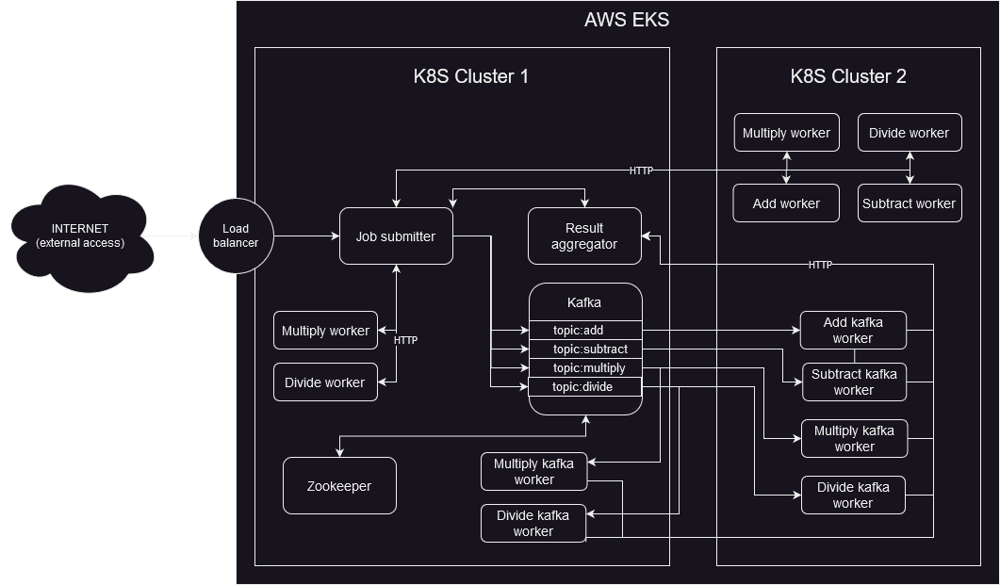

# Cilium 10

Piotr Makarewicz  
Arkadiusz Wołk  
Mateusz Zalewski  

## 1. Introduction
This case study aims to examine the features of Cilium which is goal is an “open source project to provide networking, security, and observability for cloud native environments such as Kubernetes clusters and other container orchestration platforms”, as described on Cilium main page.(Source: https://cilium.io/get-started/, access date: 31 Mar 2023)

Its goal is to showcase a portion of Cilium’s capabilities while deepening our understanding of it in the process.

## 2. Theoretical background

### eBPF

At the foundation of Cilium is a new Linux kernel technology called eBPF, which enables the dynamic insertion of powerful security, visibility, and networking control logic into the Linux kernel. eBPF is used to provide high-performance networking, multi-cluster and multi-cloud capabilities, advanced load balancing, transparent encryption, extensive network security capabilities, transparent observability, and much more. (Source: https://cilium.io/get-started/, access date: 31 Mar 2023)

### Hubble

Hubble is a fully distributed networking and security observability platform for cloud native workloads. It is built on top of Cilium and eBPF to enable deep visibility into the communication and behavior of services as well as the networking infrastructure in a completely transparent manner. (Source: https://github.com/cilium/hubble, access date: 31 Mar 2023)

### ClusterMesh
ClusterMesh is Cilium’s multi-cluster implementation that provides the following features:
- Inter-cluster pod-to-pod connectivity without gateways or proxies.
- Network policy enforcement across clusters.
- Encryption in transit between nodes within a cluster as well as across cluster boundaries.
- Show that using cilium gateways and proxies can be avoided.
- Enforce cluster wide policy.
- Encrypt communication across cluster boundaries.
- View system's current state using hubble

(Source: https://aws.amazon.com/blogs/containers/a-multi-cluster-shared-services-architecture-with-amazon-eks-using-cilium-clustermesh/, access date: 26 Apr 2023)

## 3. Case study concept description

### Main goals:
 - observe communication between nodes within one cluster using Hubble
 - enable and observe communication between nodes across different clusters using Hubble
 - see how security policies in Cilium work (filtering access based on L4 and L7 criteria)
 - examine the shared service mechanism in multi-cluster environment

### High level system diagram
On the diagram below the two cluster demo system architecture is presented. One can observe the Job submitter entrypoint, Kafka setup with Zookeeper as well as http communication with workers and communication using kafka with the kafka workers.


## 4. Technology selection

### Kubernetes cluster provider

For local development, tests in our early work we will use Kubernetes cluster hosted with **minikube**.

For the final demo, we will host the infrastructure on AWS Cloud using **Amazon EKS** Kubernetes cluster.

### Communication protocols

We want to observe different ways in which services within K8s pods communicate.

For synchronous communication, we will observe **HTTP(S)** requests sent from outside clusters to services inside as well as between services.

For asynchronous middleware-based communication we will use **Kafka** as our message broker.

### Implementation language

We will select **Python** as our implementation language because of its simplicity, expressivity and the amount of libraries that can help us. We will use **requests** library to send HTTP(S) requests, **flask** framework to create REST endpoints in services and **confluent-kafka** library to produce and consume Kafka messages.


## 5. Initial configuration description

In a local setup we only use one Kubernetes cluster. In AWS, we use two clusters.

### HTTP workers

Each of: **add_worker**, **sub_worker**, **mul_worker**, **div_worker** expose an HTTP GET endpoint `/calc` with job payload as a URL parameter. This endpoint returns synchronously the job result.

**add_worker** and **sub_worker** are deployed to cluster 2 and are accessible from cluster 1 in a shared Cilium service. In contrast, **mul_worker** and **div_worker** have only a usual non-shared Kubernetes service associated with them so they are deployed to both clusters.

### Kafka workers

Kafka workers: **add_kafka_worker**, **sub_kafka_worker**, **mul_kafka_worker**, **div_kafka_worker** read job payloads from their respective Kafka topics and save results by sending an HTTP request to **result_aggregator**. Kafka workers are deployed to cluster 1 (mul, div) and cluster 2 (add, sub, mul, div).

### Result aggregator

**result_aggregator** saves jobs results sent by Kafka workers and allows to fetch them via HTTP requests. It has a shared service assoiciated with it so it can be accessed from both clusters.

### Job submitter

**job_submitter** is the most important service.


It exposes an endpoint called `/submit`, accessible from the Internet. In request payload, user can specify:
 - operation type (addition, subtraction, multiplication, division)
 - two integers as input to an operation
 - communication mechanism that job_submitter should use to communicate with a worker(`http` or `kafka`)

It also provides a user-friendly web interface where user can specify operation along with its parameters and submit jobs. 
 
If a user chooses Kafka communication mechanism, the GUI does not return a result synchronously. Instead, user has to check the `/results` endpoint. Upon receiving a request to this endpoint, **job_submitter** sends a request to **result_aggregator**, checking for a job result and returns its response.
 
**job_submitter** is deployed to cluster 1.

### Kafka

In cluster 1, we also deploy Kafka with Zookeeper. We configure 4 topics in Kafka:

| topic | producer services | consumer services |
|-------|-----------|-----------|
| add | job_submitter | add_kafka_worker |
| sub | job_submitter | sub_kafka_worker |
| mul | job_submitter | mul_kafka_worker |
| div | job_submitter | div_kafka_worker |

Kafka has a shared Cilium service associated with it so that it is accessible from both clusters


### Clusters 2

We will use two clusters for workers:
 - 3a: **addition_worker** and **subtraction_worker**
 - 3b: **multiplication** and **division_worker**

Each worker will expose two interfaces to process requests:

 - Kafka interface:
   - consume a message with a job payload and job id from a worker-specific Kafka topic (e. g. `addition_requests` topic for `addition_worker`)
   - produce a message with a job result and job id to `results` topic


Also, each worker will expose an HTTP GET endpoint `/about` with a static HTML response.

### Shared service for clusters 1, 3a and 3b

**log_collector** should be a service available on all three clusters: 1, 3a and 3b. It will expose two REST endpoints:
 - `/save_log` - workers will use it to save logs about operations (payload and result)
 - `/logs` - users will use it to read logs 

log_collector will store the logs in a text file within a persistent volume on Kubernetes


## 6. Installation method

### Local setup with minikube (single K8S cluster)

Install minikube and docker on your local machine. For example, if you are using Ubuntu, you can download them using `snap`:

```bash
sudo snap install minikube docker
```

Install Cilium and Hubble CLI by executing script:

```
./install-cilium-hubble.sh
```

Start a minikube cluster and deploy a test application by executing script:

```bash
./run-minikube.sh
```


### Setup on AWS (two K8S clusters)

1. Create two EKS clusters in a shared security group. Add to it an inbound rule allowing TCP access from any IPv4 address on any port.

2. For each cluster you have created, add a node group and execute:
```bash
aws eks --region us-east-1 update-kubeconfig --name <cluster-name>
kubectl config rename-context <context-name> {aws-cilium-1,aws-cilium-2} # <context-name> can be obtained with "kubectl config get-contexts"
kubectl -n kube-system delete daemonset aws-node
```

3. Install Cilium on the both clusters:
```bash
cilium install --context aws-cilium-1 --cluster-name aws-cilium-1 --cluster-id 1
cilium install --context aws-cilium-2 --inherit-ca aws-cilium-1 --cluster-name aws-cilium-2 --cluster-id 2
```
4. Wait until everything is ready:
```bash
cilium status --context {aws-cilium-1,aws-cilium-2}
```
5. Enable ClusterMesh on both clusters:
```bash
cilium clustermesh enable --context aws-cilium-1 --service-type LoadBalancer
cilium clustermesh enable --context aws-cilium-2 --service-type LoadBalancer
```
6. Connect clusters using ClusterMesh (only one-way is necessary):
```bash
cilium clustermesh connect --context aws-cilium-1 --destination-context aws-cilium-2
```
7. Wait until everything is ready:
```bash
cilium clustermesh status --context aws-cilium-1
cilium clustermesh status --context aws-cilium-2
```
8. Deploy demo application:
```bash
kubectl config use-context aws-cilium-1
kubectl apply -f zookeeper.yaml
kubectl wait --for=condition=ready pod -l app=zookeeper
kubectl apply -f kafka.yaml
kubectl apply -f kafka-service.yaml
kubectl wait --for=condition=ready pod -l app=kafka
kubectl apply -f ./workers/deployment-mul.yaml
kubectl apply -f ./workers/deployment-div.yaml
kubectl apply -f ./workers/services.yaml
kubectl apply -f job-submitter/deployment.yaml
kubectl apply -f job-submitter/service.yaml
kubectl apply -f result-aggregator/deployment.yaml
kubectl apply -f result-aggregator/service.yaml

kubectl config use-context aws-cilium-2
kubectl apply -f kafka-service.yaml
kubectl apply -f ./result-aggreagtor/service.yaml
kubectl apply -f ./workers/deployment-add.yaml
kubectl apply -f ./workers/deployment-sub.yaml
kubectl apply -f ./workers/deployment-mul.yaml
kubectl apply -f ./workers/deployment-div.yaml
kubectl apply -f ./workers/services.yaml
```


9. Enable Hubble observability:
```bash
cilium hubble enable --ui --context aws-cilium-1
cilium hubble enable --ui --context aws-cilium-2
```


## 8. Demo walkthrough

### Open application GUI

Find `job-submitter` pod name (make sure you are using a context for the right cluster):

```bash
kubectl get pods
```

Setup port-forwarding to local port:

```bash
kubectl port-forward <pod-id> 8000:80
```

Navigate to http://localhost:8000.


### Access to Hubble dashboard

#### Single cluster version

```bash
cilium hubble ui
```

In a single-cluster version this gives a view similar to this:


#### Multi-cluster version

First, observe traffic on cluster 1:

```bash
kubectl config use-context aws-cilium-1
cilium hubble ui
```


Then, see traffic on cluster 2. Notice Kafka shared service is available here even though its pod is deployed in cluster 1.

```bash
kubectl config use-context aws-cilium-2
cilium hubble ui
```


### Network policies

Deploy a network policy to both clusters

```
kubectl config use-context aws-cilium-1
kubectl apply -f policies/workers-disable-http-access.yaml
kubectl config use-context aws-cilium-2
kubectl apply -f policies/workers-disable-http-access.yaml
```

Wait some time for the policies to take action. Enter application GUI and try submitting jobs. It should not work as workers' endpoints accepting jobs are disabled.

Delete these policies:

```
kubectl config use-context aws-cilium-1
kubectl apply -f policies/workers-disable-http-access.yaml
kubectl config use-context aws-cilium-2
kubectl apply -f policies/workers-disable-http-access.yaml
```

Again, wait some time, then enter GUI and submit some jobs. Now it should work as it used to.


## 9. Summary – conclusions
Cillium proved to be usefull in setting up the prepared infrastructure. It helped us establish multi-cluster connection via clustermesh, as well as formulate and implement precise security policies. Thanks to Hubble we were able to track how those policies affect communication as well as the overall architecture structure and relation between deployed services.

We had an opportunity to learn about cillium and its capabilities and are looking forward to making use of it in our future projects.

## 10. References
- Cilium information: https://cilium.io/get-started/, access date: 31 Mar, 2023
- Hubble https://github.com/cilium/hubble, access date: 31 Mar, 2023
- Setting up Kafka communication: https://blog.datumo.io/setting-up-kafka-on-kubernetes-an-easy-way-26ae150b9ca8, access date, access date: 01 Jun, 2023
- Cillium on EKS: https://aws.amazon.com/blogs/containers/a-multi-cluster-shared-services-architecture-with-amazon-eks-using-cilium-clustermesh/, access date: 8 Jun, 2023